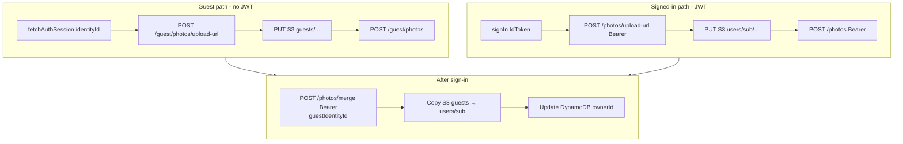
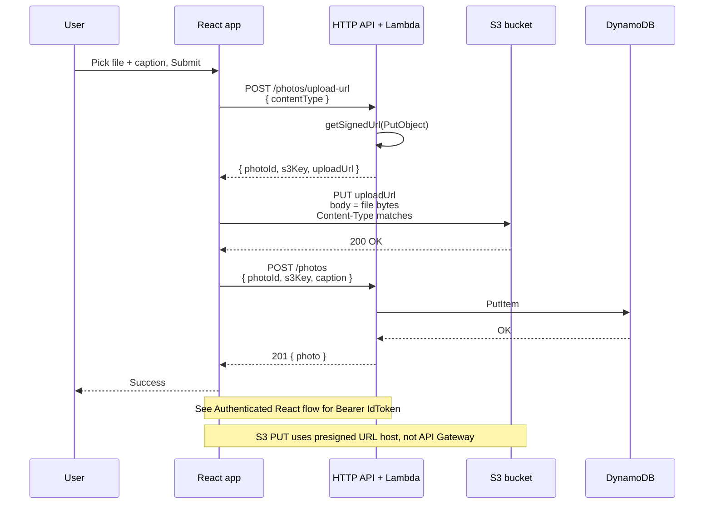
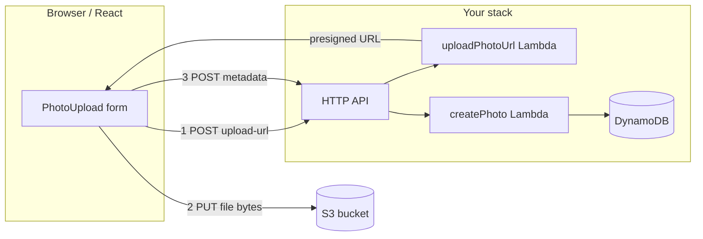
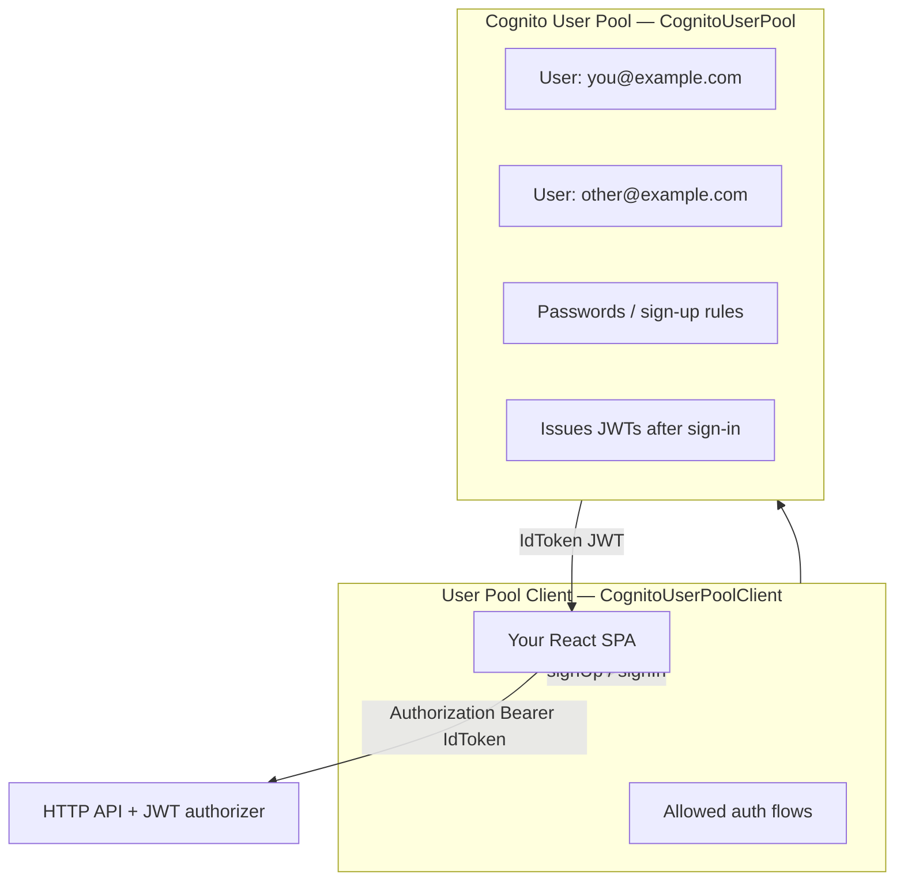
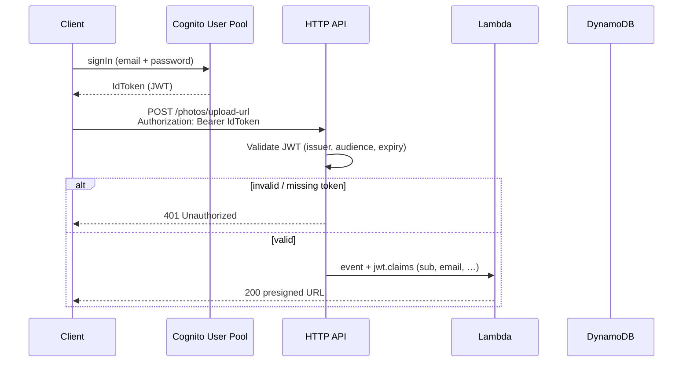
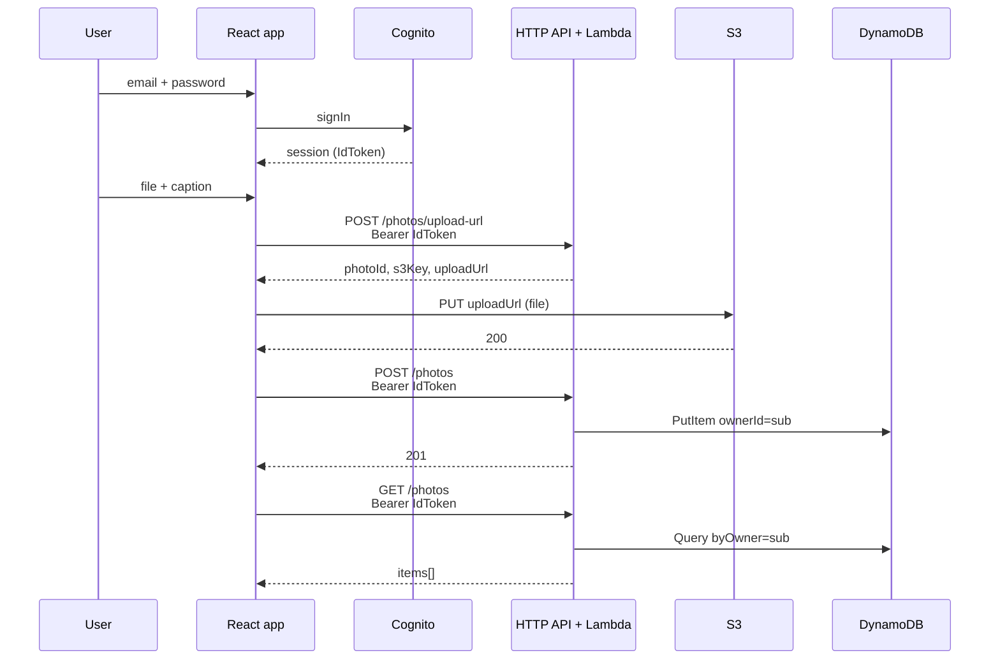

# photostore-learn

AWS Serverless learning project: **Lambda**, **API Gateway (HTTP API)**, **DynamoDB**, **S3**, and **Amazon Cognito**—through **step 8** (JWT auth, per-user photos), plus **guest uploads** (Identity Pool, max 2 photos before sign-in), **merge on sign-in**, and **client env sync** after deploy. Optional stretch: **CloudFront** (step 9).

Each service is explained where it appears in the repo; start with [AWS services in this project](#aws-services-in-this-project) in the stack reference for a one-page glossary.

## Prerequisites

- Node.js and npm
- AWS CLI configured (`aws sts get-caller-identity` works)
- **`jq`** (for `npm run env:sync` — writes the React client `.env` from stack outputs)
- IAM permissions to deploy (CloudFormation, Lambda, API Gateway, Cognito, etc.)

## Commands (use project-local Serverless v3)

Global `serverless` may be **v4**, which requires a Serverless.com login. This repo pins **Serverless Framework v3** so you can work without that:

```bash
npm install
npm run print              # validate serverless.yml
npm run deploy             # deploy stack
npm run deploy:sync        # deploy + write ../photostoreclient/.env from outputs
npm run env:sync           # sync client .env only (after deploy)
npm run env:backup         # snapshot client .env before remove
npm run remove:safe        # backup client .env, then serverless remove
npx serverless invoke -f hello --log
```

See [Client environment sync](#client-environment-sync) and [`docs/env-configuration.md`](docs/env-configuration.md) for what survives `deploy` vs `remove`.

## Client environment sync

Deploy creates AWS resources; the **React client** (`../photostoreclient`) needs matching `VITE_*` variables. They are **not** read from a backend `.env` at Lambda runtime — CloudFormation injects `PHOTOS_TABLE`, `PHOTOS_BUCKET`, etc. into functions directly.

| Layer              | Where                         | Survives `remove`? |
| ------------------ | ----------------------------- | ------------------ |
| Backend (Lambda)   | `serverless.yml` → stack      | No — stack deleted |
| Frontend (Vite)    | `../photostoreclient/.env`    | File remains (stale ids) |

```bash
npm run deploy:sync    # deploy + write client .env
# or separately:
npm run deploy && npm run env:sync
```

`env:sync` reads CloudFormation outputs and writes:

```env
VITE_API_URL=...
VITE_USER_POOL_ID=...
VITE_USER_POOL_CLIENT_ID=...
VITE_IDENTITY_POOL_ID=...
VITE_AWS_REGION=us-east-1
```

A snapshot is saved to `.deploy/outputs-dev.json` (gitignored). Before tearing down the stack:

```bash
npm run env:backup      # → .deploy/env-backups/client-env-<timestamp>.env
npm run remove:safe     # backup + serverless remove
```

After a **fresh** deploy, run `env:sync` again and restart the Vite dev server. Full notes: [`docs/env-configuration.md`](docs/env-configuration.md).

After deploy, call **`GET /hello`** using the HTTP API base URL from the deploy output:

```bash
curl "https://<api-id>.execute-api.us-east-1.amazonaws.com/hello"
```

## Current stack

- **Service:** `photostore-learn` (see `serverless.yml`)
- **Stage:** `dev` (default)
- **Lambdas:** `hello`, `createPhoto`, `listPhotos`, `uploadPhotoUrl`, `mergePhotos`, `guestUploadPhotoUrl`, `guestCreatePhoto`, `guestListPhotos` (TypeScript in `src/`, bundled with esbuild)
- **Cognito:** User Pool + SPA app client + **Identity Pool** (unauthenticated guests) — [Cognito & JWT auth](#cognito--jwt-auth-steps-68) · [Guest photos](#guest-photo-upload-identity-pool)
- **API (HTTP API, CORS enabled):**

  | Method | Path                       | Auth                         | Handler                    |
  | ------ | -------------------------- | ---------------------------- | -------------------------- |
  | `GET`  | `/hello`                   | public                       | health / event echo        |
  | `POST` | `/photos/upload-url`       | JWT (Cognito)                | presigned S3 PUT URL       |
  | `POST` | `/photos`                  | JWT (Cognito)                | save metadata              |
  | `GET`  | `/photos`                  | JWT (Cognito)                | **my** photos only         |
  | `POST` | `/photos/merge`            | JWT (Cognito)                | move guest photos → user   |
  | `POST` | `/guest/photos/upload-url` | `X-Guest-Identity-Id` header | guest presigned PUT (≤2)   |
  | `POST` | `/guest/photos`            | `X-Guest-Identity-Id`        | guest save metadata        |
  | `GET`  | `/guest/photos`            | `X-Guest-Identity-Id`        | guest list (≤2)            |

- **DynamoDB:** `photostore-learn-dev-photos` — metadata only (`s3Key` points at S3) — [Storage: S3 vs DynamoDB](#storage-s3-vs-dynamodb-what-lives-where) · [DynamoDB wiring](#dynamodb-wiring-in-serverlessyml)
- **S3:** private bucket; signed-in objects under `users/{sub}/photos/`; guest objects under `guests/{identityId}/photos/` — [Storage: S3 vs DynamoDB](#storage-s3-vs-dynamodb-what-lives-where) · [S3 wiring](#s3-wiring-in-serverlessyml)

After deploy, note **Outputs**: `UserPoolId`, `UserPoolClientId`, `IdentityPoolId`, `HttpApiUrl` (from Serverless), `CognitoIssuer`. Run **`npm run env:sync`** to write `VITE_*` values into `../photostoreclient/.env`.

### Source layout (`src/`)

Handlers, shared helpers, and AWS clients are separated so new routes and domains have a clear home:

```text
src/
  handlers/          # Lambda entry points (thin: parse event → respond)
    hello.ts         # GET /hello
    photos.ts        # POST/GET /photos*, POST /photos/merge
    guestPhotos.ts   # GET/POST /guest/photos*
  lib/               # Cross-cutting helpers (no AWS SDK)
    auth.ts          # JWT sub → ownerId; guest identity header + prefixes
    http.ts          # JSON responses, body parsing
  clients/           # AWS SDK wrappers (reused clients, env config)
    dynamo.ts
    s3.ts
  schemas/           # Zod request validation
    photos.ts
    upload.ts
    merge.ts         # POST /photos/merge body
```

When you add a new domain (e.g. albums), add `handlers/albums.ts` plus any `schemas/albums.ts`. Put new AWS services under `clients/`.

### Storage: S3 vs DynamoDB (what lives where)

The app splits **files** from **catalog rows**. Lambda and API Gateway never receive image bytes on upload—the browser sends those straight to S3.

| Store                        | Holds                                                | Does _not_ hold                                  |
| ---------------------------- | ---------------------------------------------------- | ------------------------------------------------ |
| **S3** (`PhotosBucket`)      | The actual image **file** (JPEG, PNG, or WebP bytes) | Captions, ownership lists, or queryable metadata |
| **DynamoDB** (`PhotosTable`) | **Metadata** about each photo                        | Image bytes                                      |

**DynamoDB is a reference/index.** Each row points at one object in S3 via **`s3Key`** (the object path in the bucket, e.g. `users/<cognito-sub>/photos/<photoId>.jpg`). The row also stores:

| Field       | Meaning                                             |
| ----------- | --------------------------------------------------- |
| `photoId`   | Unique id (partition key)                           |
| `ownerId`   | Cognito JWT `sub` — who owns this photo             |
| `s3Key`     | **Pointer** to the S3 object (not a public URL)     |
| `caption`   | User-visible description                            |
| `createdAt` | When the row was written (used to sort “my photos”) |

**What you upload to S3:** the raw image file from step 2 of the flow—a `PUT` to the presigned URL with the file bytes as the body and a `Content-Type` that matches what you requested in step 1 (`image/jpeg`, `image/png`, or `image/webp`). That creates (or overwrites) one object at `s3Key`.

**What you save in DynamoDB:** only JSON from step 3—`photoId`, `s3Key`, and `caption`—after S3 already has the file. No file bytes go into DynamoDB.

**Why split them:** S3 is built for large, cheap object storage; DynamoDB is built for fast queries (e.g. “all photos for this user” via GSI `byOwner`). Presigned URLs let clients upload and download without proxying megabytes through API Gateway or Lambda.

See `PhotoItem` in `src/handlers/photos.ts` and the three HTTP steps below.

### Photo upload flow (steps 5 + 7–8)

Photo routes require **`Authorization: Bearer <IdToken>`** (Cognito). `GET /hello` stays public.

Use deploy **Outputs** for `API`, `UserPoolId`, `UserPoolClientId`. Create a user once:

```bash
aws cognito-idp sign-up \
  --client-id "$CLIENT_ID" \
  --username "you@example.com" \
  --password 'YourPass1!' \
  --user-attributes Name=email,Value=you@example.com

aws cognito-idp admin-confirm-sign-up \
  --user-pool-id "$USER_POOL_ID" \
  --username "you@example.com"

TOKEN=$(aws cognito-idp initiate-auth \
  --auth-flow USER_PASSWORD_AUTH \
  --client-id "$CLIENT_ID" \
  --auth-parameters USERNAME=you@example.com,PASSWORD='YourPass1!' \
  --query 'AuthenticationResult.IdToken' --output text)

AUTH="Authorization: Bearer $TOKEN"

# 1. Get presigned upload URL + photoId + s3Key
curl -s -X POST "$API/photos/upload-url" \
  -H "content-type: application/json" \
  -H "$AUTH" \
  -d '{"contentType":"image/jpeg"}' | tee /tmp/upload.json

# 2. PUT image bytes directly to S3 (not through API Gateway)
UPLOAD_URL=$(jq -r .uploadUrl /tmp/upload.json)
curl -X PUT -H "Content-Type: image/jpeg" --data-binary @photo.jpg "$UPLOAD_URL"

# 3. Save metadata in DynamoDB (use photoId + s3Key from step 1)
PHOTO_ID=$(jq -r .photoId /tmp/upload.json)
S3_KEY=$(jq -r .s3Key /tmp/upload.json)
curl -s -X POST "$API/photos" \
  -H "content-type: application/json" \
  -H "$AUTH" \
  -d "{\"photoId\":\"$PHOTO_ID\",\"s3Key\":\"$S3_KEY\",\"caption\":\"beach sunset\"}"

# 4. List my photos (metadata + presigned imageUrl per row)
curl -s -H "$AUTH" "$API/photos" | jq .

# Use imageUrl in a browser  or download with curl:
# IMAGE_URL=$(curl -s -H "$AUTH" "$API/photos" | jq -r '.items[0].imageUrl')
# curl -o thumb.jpg "$IMAGE_URL"

# Without token → 401 from API Gateway
curl -s -o /dev/null -w "%{http_code}\n" "$API/photos"
```

`s3Key` from step 1 looks like `users/<cognito-sub>/photos/<uuid>.jpg`.

#### Handlers and routes (same upload flow)

One user journey, **three HTTP steps**, **two API Lambdas** in `src/handlers/photos.ts`. Step 2 has no Lambda—the client talks to S3 directly.

| Step     | Route                     | `serverless.yml` function | Handler (`src/handlers/photos.ts`) | What it does                                                                    |
| -------- | ------------------------- | ------------------------- | ---------------------------------- | ------------------------------------------------------------------------------- |
| **1**    | `POST /photos/upload-url` | `uploadPhotoUrl`          | `uploadUrl`                        | Presign S3 `PUT`; return `photoId`, `s3Key`, `uploadUrl`                        |
| **2**    | `PUT` presigned URL       | —                         | —                                  | Client uploads file bytes to **S3** (not API Gateway)                           |
| **3**    | `POST /photos`            | `createPhoto`             | **`create`**                       | Validate body; **PutItem** metadata to DynamoDB                                 |
| _(list)_ | `GET /photos`             | `listPhotos`              | `list`                             | **Query** GSI `byOwner` = JWT `sub`; each row includes presigned **`imageUrl`** |

```text
uploadUrl  →  (client PUT S3)  →  create
   ↑                                  ↑
   POST /photos/upload-url            POST /photos
```

- **`uploadUrl`** — S3 presigning only; does not write DynamoDB or receive file bytes.
- **`create`** — DynamoDB only; assumes the object already exists at `s3Key`. Skipping step 3 leaves an orphan file in S3 with no row in `GET /photos`.

### Guest photo upload (Identity Pool)

Visitors can upload **up to 2 photos** before creating an account. They use the same three-step pattern (presign → PUT S3 → save metadata), but **no JWT** — the client sends **`X-Guest-Identity-Id`** from Amplify’s unauthenticated Identity Pool session.

#### Cognito Identity Pool (what it adds)

| Piece | Role in this repo |
| ----- | ----------------- |
| **Identity Pool** | Issues a stable **`identityId`** (`us-east-1:uuid`) for browsers that have not signed in |
| **Unauthenticated role** | Minimal IAM — only `cognito-identity:GetId` (guest uploads use **presigned URLs** from Lambda, not direct S3 credentials) |
| **User Pool link** | Same pool/client as sign-in; after login, authenticated identities use the API JWT path |

Configure Amplify with `identityPoolId` (from deploy output / `VITE_IDENTITY_POOL_ID`). Call `fetchAuthSession()` **before** sign-in to obtain `identityId` for the guest header.

#### Guest vs signed-in storage

| | DynamoDB `ownerId` | S3 key prefix |
| - | ------------------ | ------------- |
| **Guest** | `guest#{identityId}` | `guests/{identityId}/photos/{photoId}.{ext}` |
| **Signed-in** | JWT `sub` | `users/{sub}/photos/{photoId}.{ext}` |

Guest routes validate the header in `src/lib/auth.ts` (`GUEST_PHOTO_LIMIT = 2`). Responses include `remainingUploads` and `limit`.

#### Guest API routes

| Step | Route | Auth | Handler (`guestPhotos.ts`) |
| ---- | ----- | ---- | -------------------------- |
| 1 | `POST /guest/photos/upload-url` | `X-Guest-Identity-Id` | `uploadUrl` |
| 2 | `PUT` presigned URL | — | Client → S3 |
| 3 | `POST /guest/photos` | `X-Guest-Identity-Id` | `create` |
| list | `GET /guest/photos` | `X-Guest-Identity-Id` | `list` |

```bash
# Obtain identityId from your SPA (Amplify fetchAuthSession) or AWS CLI against the Identity Pool
GUEST_ID="us-east-1:xxxxxxxx-xxxx-xxxx-xxxx-xxxxxxxxxxxx"
HDR="X-Guest-Identity-Id: $GUEST_ID"

curl -s -X POST "$API/guest/photos/upload-url" \
  -H "content-type: application/json" \
  -H "$HDR" \
  -d '{"contentType":"image/jpeg"}' | tee /tmp/guest-upload.json

UPLOAD_URL=$(jq -r .uploadUrl /tmp/guest-upload.json)
curl -X PUT -H "Content-Type: image/jpeg" --data-binary @photo.jpg "$UPLOAD_URL"

PHOTO_ID=$(jq -r .photoId /tmp/guest-upload.json)
S3_KEY=$(jq -r .s3Key /tmp/guest-upload.json)
curl -s -X POST "$API/guest/photos" \
  -H "content-type: application/json" \
  -H "$HDR" \
  -d "{\"photoId\":\"$PHOTO_ID\",\"s3Key\":\"$S3_KEY\",\"caption\":\"try before signup\"}"

curl -s -H "$HDR" "$API/guest/photos" | jq .
```

#### Sequence: guest upload (no JWT)

```mermaid
sequenceDiagram
  participant User
  participant React as React app
  participant Cognito as Identity Pool
  participant API as HTTP API + Lambda
  participant S3 as S3
  participant DDB as DynamoDB

  User->>React: Pick file (not signed in)
  React->>Cognito: fetchAuthSession()
  Cognito-->>React: identityId

  React->>API: POST /guest/photos/upload-url<br/>X-Guest-Identity-Id
  API->>API: Check count &lt; 2, presign PutObject
  API-->>React: photoId, s3Key, uploadUrl

  React->>S3: PUT uploadUrl
  S3-->>React: 200

  React->>API: POST /guest/photos<br/>X-Guest-Identity-Id
  API->>DDB: PutItem ownerId=guest#identityId
  API-->>React: 201
```

#### Flowchart: guest vs authenticated paths



### Merge guest photos after sign-in

**`mergePhotos`** — Lambda `src/handlers/photos.merge`, route **`POST /photos/merge`**, JWT authorizer `cognitoJwt` in `serverless.yml`.

Moves guest uploads into the signed-in user's account after Cognito login. Before sign-in, the SPA uses the Identity Pool (unauthenticated) and **`/guest/photos*`** routes. Bytes live at `guests/{identityId}/photos/` in S3 and metadata uses DynamoDB `ownerId = guest#{identityId}`. After sign-in, this endpoint re-homes those rows and objects under `users/{sub}/photos/` where `sub` is the JWT subject.

#### When to call (client)

- **Once** after `signUp` or `signIn` — not on every page load.
- While still a guest, save `identityId` from `fetchAuthSession()` (e.g. `localStorage`).
- After login, `POST /photos/merge` with that value and a valid **IdToken**.
- Then use normal authenticated upload helpers (`/photos/upload-url`, etc.).

**React tip:** persist `session.identityId` from the pre-login `fetchAuthSession()` call; after `signIn`, call merge once, then list with `GET /photos`.

#### Request

| Item | Value |
| ---- | ----- |
| Method | `POST` |
| Path | `/photos/merge` |
| Auth | `Authorization: Bearer <Cognito IdToken>` |
| Headers | No `X-Guest-Identity-Id` (JWT only) |
| Body | `{ "guestIdentityId": "us-east-1:uuid" }` — Cognito Identity Pool id (`region:uuid`); validated in `src/schemas/merge.ts` |

`guestIdentityId` must be the **same** id sent as `X-Guest-Identity-Id` during guest uploads so the handler can find `ownerId = guest#{guestIdentityId}`.

#### Response (`200`)

```json
{
  "mergedCount": 2,
  "photos": [
    {
      "photoId": "...",
      "ownerId": "<JWT sub>",
      "s3Key": "users/<sub>/photos/<filename>",
      "caption": "...",
      "createdAt": "..."
    }
  ]
}
```

- **`mergedCount`** — number of photos moved in this call.
- **`photos`** — updated metadata rows (same `photoId`, new `ownerId` and `s3Key`).
- **Empty guest:** `{ "mergedCount": 0, "photos": [] }` — safe to retry if the user had nothing to merge.

#### What changes in AWS

| Store | Before merge | After merge |
| ----- | ------------ | ----------- |
| S3 key | `guests/{id}/photos/...` | `users/{sub}/photos/...` |
| DynamoDB `ownerId` | `guest#{id}` | JWT `sub` |
| `photoId` | unchanged | unchanged (same partition key) |

#### Errors

| Status | Cause |
| ------ | ----- |
| `401` | Missing/invalid JWT or no `sub` claim |
| `400` | Missing body or invalid `guestIdentityId` (Zod) |
| `500` | DynamoDB query failed, or S3 copy/delete failed mid-loop |

On `500` during the per-photo loop, the response may include a **partial** `mergedCount` for photos already moved.

#### Implementation (`photos.merge`)

1. Query GSI **`byOwner`** where `ownerId = guest#{guestIdentityId}`.
2. For each photo:
   - **S3** `CopyObject` → `users/{sub}/photos/{filename}`
   - **S3** `DeleteObject` on the old `guests/...` key
   - **DynamoDB** `DeleteItem` + `PutItem` with new `ownerId` and `s3Key` (same `photoId`)

**IAM** (shared Lambda role): `dynamodb:Query`, `PutItem`, `DeleteItem`; `s3:CopyObject`, `s3:DeleteObject` on the photos bucket.

#### Try it

```bash
# After obtaining TOKEN (see Photo upload flow)
curl -s -X POST "$API/photos/merge" \
  -H "content-type: application/json" \
  -H "Authorization: Bearer $TOKEN" \
  -d "{\"guestIdentityId\":\"$GUEST_ID\"}" | jq .

curl -s -H "Authorization: Bearer $TOKEN" "$API/photos" | jq .
```

```mermaid
sequenceDiagram
  participant React
  participant API as HTTP API + Lambda
  participant S3
  participant DDB as DynamoDB

  Note over React: User was guest; now has IdToken
  React->>API: POST /photos/merge<br/>Bearer + guestIdentityId
  API->>DDB: Query ownerId=guest#id
  loop each guest photo
    API->>S3: CopyObject guests/... → users/sub/...
    API->>DDB: DeleteItem + PutItem ownerId=sub
    API->>S3: DeleteObject old key
  end
  API-->>React: mergedCount, photos[]
```

#### Auth comparison

| Field / header | Guest routes | Signed-in routes | Merge |
| -------------- | ------------ | ---------------- | ----- |
| `Authorization: Bearer` | — | Required | Required |
| `X-Guest-Identity-Id` | Required | — | — |
| Body | upload / metadata | upload / metadata | `{ "guestIdentityId": "region:uuid" }` |

### React / Amplify client flow

A browser app (including **Amplify Hosting + React**) uses the same three HTTP steps as `curl`. Only **two** requests hit your API; the file goes **directly to S3**.

Set the API base URL in the frontend (e.g. Vite `VITE_API_URL=https://<api-id>.execute-api.us-east-1.amazonaws.com`).

#### Sequence (one photo upload)



#### Request checklist

| Step | From                 | Method | URL                       | Body                                                   |
| ---- | -------------------- | ------ | ------------------------- | ------------------------------------------------------ |
| 1    | React → **your API** | `POST` | `{API}/photos/upload-url` | `{ "contentType": "image/jpeg" }`                      |
| 2    | React → **S3**       | `PUT`  | `uploadUrl` from step 1   | Raw `File` / `Blob` (same `Content-Type`)              |
| 3    | React → **your API** | `POST` | `{API}/photos`            | `{ "photoId", "s3Key", "caption" }` from step 1 + form |

**List / gallery:** `GET {API}/photos` returns metadata plus a presigned **`imageUrl`** per row (1 hour TTL). Re-fetch the list when URLs expire. Image bytes still come from **S3**, not API Gateway.

#### Flowchart (who talks to whom)



#### Minimal React helper (copy-paste)

```ts
const API = import.meta.env.VITE_API_URL; // no trailing slash

export async function uploadPhoto(file: File, caption: string) {
  // Map file MIME type → allowed contentType for presigning
  const contentType =
    file.type === "image/png"
      ? "image/png"
      : file.type === "image/webp"
        ? "image/webp"
        : "image/jpeg";

  // Step 1: POST to your API → Lambda uploadUrl → presigned PUT URL + photoId + s3Key
  const signRes = await fetch(`${API}/photos/upload-url`, {
    method: "POST",
    headers: { "Content-Type": "application/json" },
    body: JSON.stringify({ contentType }),
  });
  if (!signRes.ok) throw new Error(await signRes.text());
  const { photoId, s3Key, uploadUrl } = await signRes.json();

  // Step 2: PUT file bytes directly to S3 (not API Gateway); Content-Type must match step 1
  const putRes = await fetch(uploadUrl, {
    method: "PUT",
    headers: { "Content-Type": contentType },
    body: file,
  });
  if (!putRes.ok) throw new Error(await putRes.text());

  // Step 3: POST to your API → Lambda create → DynamoDB PutItem (metadata catalog)
  const metaRes = await fetch(`${API}/photos`, {
    method: "POST",
    headers: { "Content-Type": "application/json" },
    body: JSON.stringify({ photoId, s3Key, caption }),
  });
  if (!metaRes.ok) throw new Error(await metaRes.text());
}
```

**Note:** This example is **pre-auth** (step 5). For Cognito + JWT use [Authenticated React / Amplify flow](#authenticated-react--amplify-flow).

Allowed `contentType` values: `image/jpeg`, `image/png`, `image/webp` (default `image/jpeg`). Presigned URLs expire after **5 minutes** (`UPLOAD_URL_EXPIRES_SECONDS` in `src/clients/s3.ts`).

**How presigning works:** [S3 presigned URLs](#s3-presigned-urls-how-upload-signing-works) (recommended read after your first successful upload).

**Auth & React:** [Cognito & JWT auth](#cognito--jwt-auth-steps-68) · [Authenticated React / Amplify flow](#authenticated-react--amplify-flow)

**Guest uploads:** [Guest photo upload](#guest-photo-upload-identity-pool) · **Merge after login:** [Merge guest photos](#merge-guest-photos-after-sign-in) · **Client env:** [Client environment sync](#client-environment-sync)

**Next lesson step:** **9. Optional stretch goals** in the [learning path](#learning-path-recommended-order) (CloudFront).

---

## Cognito & JWT auth (steps 6–8)

#### What is Amazon Cognito?

**Amazon Cognito** handles **application users**: sign-up, sign-in, password rules, and issuing **JWT tokens** so your API knows who is calling. It is **not** your photo database and **not** Lambda.

| Piece                              | What it does                                                                                 |
| ---------------------------------- | -------------------------------------------------------------------------------------------- |
| **User Pool**                      | Directory of users (this repo: email + password).                                            |
| **User Pool Client**               | Your SPA’s app id — allowed login flows; JWT **audience**.                                   |
| **IdToken (JWT)**                  | Sent as `Authorization: Bearer …` to API Gateway; includes **`sub`** (user id).              |
| **Identity Pool** | Unauthenticated **`identityId`** for guest uploads (`X-Guest-Identity-Id`); minimal IAM on the guest role. Uploads still use **presigned URLs** from Lambda. |

Sign-up and sign-in go **Client ↔ Cognito** directly. Your Lambdas only see the validated JWT claims after API Gateway’s authorizer runs.

### What was added

| Step  | Idea                           | In this repo                                                                       |
| ----- | ------------------------------ | ---------------------------------------------------------------------------------- |
| **6** | Cognito User Pool + app client | `CognitoUserPool`, `CognitoUserPoolClient` in `serverless.yml`                     |
| **7** | JWT authorizer on HTTP API     | `cognitoJwt` on `/photos*`; `401` without valid `Authorization: Bearer`            |
| **8** | `ownerId` from JWT `sub`       | `ownerId` on items; S3 keys under `users/{sub}/`; `GET /photos` uses GSI `byOwner` |

`GET /hello` has **no** authorizer (health check).

### What is `sub`? (and `ownerId`)

When a user signs in, Cognito returns a **JWT** (JSON Web Token). A JWT is a signed blob of **claims** — name/value pairs about the user. One standard claim is **`sub`**.

| Term          | Meaning                                                                                                                |
| ------------- | ---------------------------------------------------------------------------------------------------------------------- |
| **`sub`**     | **Subject** — the unique, stable **user id** inside this Cognito User Pool. From the JWT claim named `sub`.            |
| **`ownerId`** | **Our app’s name** for that same value when we store it in DynamoDB or build S3 paths. In code we set `ownerId = sub`. |

They are the **same id**; we say `ownerId` in the photo domain (“who owns this row?”) and `sub` when talking about the token.

#### Example IdToken claims (simplified)

After sign-in, the decoded JWT payload includes claims like:

```json
{
  "sub": "a1b2c3d4-e5f6-7890-abcd-ef1234567890",
  "email": "you@example.com",
  "iss": "https://cognito-idp.us-east-1.amazonaws.com/us-east-1_XXXXX",
  "aud": "your-app-client-id",
  "exp": 1710000000
}
```

| Claim     | Role                                                                                     |
| --------- | ---------------------------------------------------------------------------------------- |
| **`sub`** | **Who is logged in** — use this to scope data. Never changes for that user in this pool. |
| `email`   | Human-readable login; can change; **do not** use as the only primary key for ownership.  |
| `iss`     | Issuer — API Gateway checks it matches your User Pool.                                   |
| `aud`     | Audience — must match your **User Pool Client** id.                                      |
| `exp`     | Expiry — token invalid after this time.                                                  |

`sub` often looks like a UUID (e.g. `a1b2c3d4-e5f6-...`). It is **not** the user’s email.

#### Why we use `sub` as `ownerId` (step 8)

| Without `sub`                                                  | With `sub` → `ownerId`                                                           |
| -------------------------------------------------------------- | -------------------------------------------------------------------------------- |
| `GET /photos` could return **everyone’s** photos (global Scan) | `GET /photos` returns **only this user’s** rows (`Query` on GSI `byOwner`)       |
| Anyone could guess another user’s `s3Key`                      | Keys are under `users/{sub}/photos/...`; `create` rejects keys for another `sub` |
| Tying data to email breaks if the user changes email           | `sub` stays the same for the life of the account in that pool                    |

The client **cannot** choose `ownerId` in the request body. Lambda reads it from the token API Gateway already validated:

```text
Authorization: Bearer <IdToken>
  → API Gateway checks signature / iss / aud / exp
  → Lambda: event.requestContext.authorizer.jwt.claims.sub
  → src/lib/auth.ts: getOwnerId() / requireOwnerId()
  → src/handlers/photos.ts: ownerId on PutItem; Query byOwner; s3Key prefix users/{ownerId}/photos/
```

```ts
// src/lib/auth.ts — sub from the JWT, exposed as ownerId to the rest of the app
const sub = event.requestContext.authorizer.jwt.claims.sub;
// same value stored on each photo row as ownerId
```

**Rule of thumb:** **`sub` = Cognito’s user id in the token.** **`ownerId` = that id in your database and S3 layout.**

### Cognito User Pool vs User Pool Client

Think of Cognito as **two layers**: a directory of users, and an **app registration** that is allowed to talk to that directory.



#### `CognitoUserPool` (User Pool)

|                    |                                                                                                                                                   |
| ------------------ | ------------------------------------------------------------------------------------------------------------------------------------------------- |
| **What it is**     | The **user directory** for your app: accounts, passwords, email verification, token signing.                                                      |
| **In this repo**   | CloudFormation resource `CognitoUserPool` in `serverless.yml`                                                                                     |
| **Analogy**        | The “database of users” — not your DynamoDB photo table, but **who can log in**.                                                                  |
| **You get**        | After sign-in, Cognito issues **JWTs** (we use the **IdToken**). The token’s **`sub`** claim is a stable user id (used as `ownerId` in DynamoDB). |
| **This pool uses** | **Email** as username (`UsernameAttributes: email`), auto-verified email, password policy (8+ chars, upper, lower, number).                       |

Users are created with `sign-up` (CLI or Amplify). You do **not** store passwords in Lambda or DynamoDB.

#### `CognitoUserPoolClient` (App client)

|                             |                                                                                                                                                 |
| --------------------------- | ----------------------------------------------------------------------------------------------------------------------------------------------- |
| **What it is**              | A **public client** record that represents _your frontend app_ (browser / React). It defines **how** the app may authenticate against the pool. |
| **In this repo**            | `CognitoUserPoolClient`, linked to the pool via `UserPoolId: !Ref CognitoUserPool`                                                              |
| **Analogy**                 | An “app id” in front of the user pool — same pool can have multiple clients (iOS, web, admin) with different settings.                          |
| **`GenerateSecret: false`** | Required for SPAs. Browsers cannot keep a client secret. (Secrets are for server-side apps only.)                                               |
| **`ExplicitAuthFlows`**     | `USER_PASSWORD_AUTH` (CLI/testing), `USER_SRP_AUTH` (Amplify default), `REFRESH_TOKEN_AUTH` (stay logged in).                                   |
| **Deploy output**           | **`UserPoolClientId`** — this is the JWT **`aud` (audience)** API Gateway checks.                                                               |

**User Pool** = who users are. **User Pool Client** = which app is asking and which login methods are allowed.

**Identity Pool (implemented):** `CognitoIdentityPool` with `AllowUnauthenticatedIdentities: true`. Guests get an `identityId` for API scoping; they do **not** receive broad S3 credentials — Lambda still presigns uploads. See [Guest photo upload](#guest-photo-upload-identity-pool).

**Not in this repo (optional):** browser **direct S3** access via Identity Pool credentials (we use presigned URLs instead).

### Wiring Cognito in `serverless.yml`

Cognito is connected in **four places**: CloudFormation **resources**, HTTP API **JWT authorizer**, **function events**, and **outputs**.

```text
resources (pool + client)
       ↓ issuer + audience
provider.httpApi.authorizers.cognitoJwt
       ↓ authorizer: cognitoJwt
functions: /photos* routes
       ↓
API Gateway validates JWT → Lambda reads event.requestContext.authorizer.jwt.claims.sub
```

#### 1. Resources — create pool and client

```yaml
resources:
  Resources:
    CognitoUserPool:
      Type: AWS::Cognito::UserPool
      Properties:
        UserPoolName: ${self:service}-${sls:stage}-users
        UsernameAttributes: [email]
        AutoVerifiedAttributes: [email]
        Policies:
          PasswordPolicy: { ... }

    CognitoUserPoolClient:
      Type: AWS::Cognito::UserPoolClient
      Properties:
        ClientName: ${self:service}-${sls:stage}-spa
        UserPoolId: !Ref CognitoUserPool
        GenerateSecret: false
        ExplicitAuthFlows:
          - ALLOW_USER_PASSWORD_AUTH
          - ALLOW_USER_SRP_AUTH
          - ALLOW_REFRESH_TOKEN_AUTH
```

| Property                              | Why                                                                             |
| ------------------------------------- | ------------------------------------------------------------------------------- |
| `UsernameAttributes: email`           | Users sign in with email, not a separate username.                              |
| `GenerateSecret: false`               | SPA-safe; no embedded secret in React.                                          |
| `PreventUserExistenceErrors: ENABLED` | Same error for “user not found” vs “wrong password” (slightly better security). |

#### 2. JWT authorizer — API Gateway checks tokens (step 7)

Under `provider.httpApi`:

```yaml
authorizers:
  cognitoJwt:
    type: jwt
    identitySource: $request.header.Authorization
    issuerUrl: !Sub https://cognito-idp.${AWS::Region}.amazonaws.com/${CognitoUserPool}
    audience:
      - !Ref CognitoUserPoolClient
```

| Piece            | Role                                                                                                                                     |
| ---------------- | ---------------------------------------------------------------------------------------------------------------------------------------- |
| `type: jwt`      | HTTP API validates a **Bearer JWT** before invoking Lambda.                                                                              |
| `identitySource` | Read token from `Authorization: Bearer <IdToken>`.                                                                                       |
| `issuerUrl`      | Must match token **`iss`** — proves Cognito signed it. Built from **User Pool id**.                                                      |
| `audience`       | Must match token **`aud`** — proves token was issued for **this app client**. Use **`UserPoolClientId`** (`!Ref CognitoUserPoolClient`). |

Invalid or missing tokens → **401** from API Gateway (Lambda never runs).

#### 3. Attach authorizer to routes

```yaml
createPhoto:
  events:
    - httpApi:
        path: /photos
        method: POST
        authorizer:
          name: cognitoJwt # must match provider.httpApi.authorizers key
```

Same for `GET /photos` and `POST /photos/upload-url`. **`hello`** has **no** `authorizer` — stays public.

#### 4. Environment variables and outputs (for frontends / debugging)

```yaml
provider:
  environment:
    COGNITO_USER_POOL_ID: !Ref CognitoUserPool
    COGNITO_CLIENT_ID: !Ref CognitoUserPoolClient

resources:
  Outputs:
    UserPoolId:
      Value: !Ref CognitoUserPool
    UserPoolClientId:
      Value: !Ref CognitoUserPoolClient
    CognitoIssuer:
      Value: !Sub https://cognito-idp.${AWS::Region}.amazonaws.com/${CognitoUserPool}
```

| Output / env       | Use                                                                              |
| ------------------ | -------------------------------------------------------------------------------- |
| `UserPoolId`       | `VITE_USER_POOL_ID` in React / Amplify                                           |
| `UserPoolClientId` | `VITE_USER_POOL_CLIENT_ID` in React / Amplify                                    |
| `IdentityPoolId`   | `VITE_IDENTITY_POOL_ID` — guest `fetchAuthSession().identityId`                  |
| `CognitoIssuer`    | Must match JWT authorizer `issuerUrl` (debugging)                                |
| `HttpApiUrl`       | From **Serverless** automatically (do not duplicate in `Outputs`) — API base URL |

Use **`npm run env:sync`** to populate all `VITE_*` values in `../photostoreclient/.env` after deploy.

Lambda does **not** verify JWTs itself for protected routes; API Gateway does. `src/lib/auth.ts` only reads **`sub`** from claims the authorizer already validated.

#### 5. Identity Pool — guest `identityId` (no JWT on `/guest/*`)

```yaml
CognitoIdentityPool:
  Type: AWS::Cognito::IdentityPool
  Properties:
    AllowUnauthenticatedIdentities: true
    CognitoIdentityProviders:
      - ClientId: !Ref CognitoUserPoolClient
        ProviderName: !Sub cognito-idp.${AWS::Region}.amazonaws.com/${CognitoUserPool}

CognitoIdentityPoolRoles:
  Type: AWS::Cognito::IdentityPoolRoleAttachment
  Properties:
    Roles:
      unauthenticated: !GetAtt CognitoUnauthenticatedRole.Arn
      authenticated: !GetAtt CognitoAuthenticatedRole.Arn
```

| Piece | Role |
| ----- | ---- |
| `AllowUnauthenticatedIdentities` | Browser can call `GetId` before sign-in |
| `CognitoUnauthenticatedRole` | Minimal policy (`cognito-identity:GetId` only) |
| Guest routes | No `authorizer` in `serverless.yml`; Lambda trusts `X-Guest-Identity-Id` + prefix checks |
| `IdentityPoolId` output | `VITE_IDENTITY_POOL_ID` via `npm run env:sync` |

### JWT request flow



API Gateway validates the JWT **before** Lambda runs. Handlers read `sub` via `src/lib/auth.ts` as `ownerId`.

#### JWT request checklist

**Phase A — Sign in (Cognito only; no Lambda, no API Gateway)**

| Step | From                 | To                    | Method / action               | What happens                                           |
| ---- | -------------------- | --------------------- | ----------------------------- | ------------------------------------------------------ |
| A1   | Client (React / CLI) | **Cognito User Pool** | `signUp` or admin create user | Account created in the pool                            |
| A2   | Client               | **Cognito**           | `signIn` (email + password)   | Cognito checks credentials                             |
| A3   | Cognito              | Client                | —                             | Returns tokens; you use **`IdToken`** for the API      |
| A4   | Client               | —                     | Store `IdToken`               | e.g. Amplify session; refresh via `REFRESH_TOKEN_AUTH` |

**Phase B — Call a protected route (e.g. `POST /photos/upload-url`)**

| Step | From            | To           | Method                        | Headers / body                                                                            | Result                      |
| ---- | --------------- | ------------ | ----------------------------- | ----------------------------------------------------------------------------------------- | --------------------------- |
| B1   | Client          | **HTTP API** | `POST`                        | `Authorization: Bearer <IdToken>`<br/>`Content-Type: application/json`<br/>body per route | Request hits API Gateway    |
| B2   | **API Gateway** | —            | JWT authorizer (`cognitoJwt`) | Checks `iss`, `aud`, signature, expiry                                                    | **401** if invalid/missing  |
| B3   | API Gateway     | **Lambda**   | invoke                        | `event.requestContext.authorizer.jwt.claims` (includes **`sub`**)                         | Handler runs                |
| B4   | Lambda          | Client       | HTTP response                 | JSON body (e.g. presigned URL)                                                            | **200** / **4xx** / **5xx** |

**Phase B for each photo route**

| Step  | Route                     | Lambda handler | Lambda uses `sub` for                               |
| ----- | ------------------------- | -------------- | --------------------------------------------------- |
| B1–B4 | `POST /photos/upload-url` | `uploadUrl`    | S3 key `users/{sub}/photos/{id}.jpg`                |
| B1–B4 | `POST /photos`            | `create`       | `ownerId` on DynamoDB row; validates `s3Key` prefix |
| B1–B4 | `GET /photos`             | `list`         | `Query` GSI `byOwner` where `ownerId = sub`         |

**Public route (no JWT)**

| Step | From   | To       | Method       | Auth                                                                 |
| ---- | ------ | -------- | ------------ | -------------------------------------------------------------------- |
| —    | Client | HTTP API | `GET /hello` | **None** — no `Authorization` header; Lambda runs without authorizer |

**Quick checks**

| You send                                     | You get           | Meaning                                              |
| -------------------------------------------- | ----------------- | ---------------------------------------------------- |
| No `Authorization` on `/photos`              | **401**           | Authorizer blocked the request                       |
| Valid `Bearer <IdToken>`                     | **200** / **201** | Token OK; Lambda ran                                 |
| Expired or wrong-pool token                  | **401**           | `iss` / `aud` / expiry failed                        |
| Valid token, wrong `s3Key` on `POST /photos` | **403**           | JWT OK; Lambda rejected key not under `users/{sub}/` |

### Authenticated React / Amplify flow

Install in your React app:

```bash
npm install aws-amplify
```

Env (Vite example) — values from `npx serverless deploy` **Outputs**:

```env
VITE_API_URL=https://<api-id>.execute-api.us-east-1.amazonaws.com
VITE_USER_POOL_ID=us-east-1_xxxx
VITE_USER_POOL_CLIENT_ID=xxxxxxxx
VITE_IDENTITY_POOL_ID=us-east-1:xxxxxxxx-xxxx-xxxx-xxxx-xxxxxxxxxxxx
VITE_AWS_REGION=us-east-1
```

Or run **`npm run env:sync`** from the repo root after deploy (writes `../photostoreclient/.env` automatically).

#### Configure Amplify Auth

```ts
// src/amplify.ts
import { Amplify } from "aws-amplify";

Amplify.configure({
  Auth: {
    Cognito: {
      userPoolId: import.meta.env.VITE_USER_POOL_ID,
      userPoolClientId: import.meta.env.VITE_USER_POOL_CLIENT_ID,
      identityPoolId: import.meta.env.VITE_IDENTITY_POOL_ID,
    },
  },
});
```

#### Sequence: sign-in + upload (with JWT)



#### Auth helper + API headers

```ts
// src/lib/apiAuth.ts
import { fetchAuthSession } from "aws-amplify/auth";

const API = import.meta.env.VITE_API_URL;

/** Headers for protected photo routes (steps 7–8). */
export async function authHeaders(): Promise<HeadersInit> {
  const session = await fetchAuthSession();
  const token = session.tokens?.idToken?.toString();
  if (!token) throw new Error("Not signed in");
  return {
    "Content-Type": "application/json",
    Authorization: `Bearer ${token}`,
  };
}

export { API };
```

#### Upload with JWT (full example)

```ts
// src/lib/uploadPhoto.ts
import { signIn } from "aws-amplify/auth";
import { API, authHeaders } from "./apiAuth";

export async function signInUser(email: string, password: string) {
  await signIn({ username: email, password });
}

export async function uploadPhoto(file: File, caption: string) {
  const headers = await authHeaders();

  const contentType =
    file.type === "image/png"
      ? "image/png"
      : file.type === "image/webp"
        ? "image/webp"
        : "image/jpeg";

  // Step 1: POST presign (JWT required) → uploadUrl Lambda
  const signRes = await fetch(`${API}/photos/upload-url`, {
    method: "POST",
    headers,
    body: JSON.stringify({ contentType }),
  });
  if (!signRes.ok) throw new Error(await signRes.text());
  const { photoId, s3Key, uploadUrl } = await signRes.json();

  // Step 2: PUT to S3 (no JWT — presigned URL is the credential)
  const putRes = await fetch(uploadUrl, {
    method: "PUT",
    headers: { "Content-Type": contentType },
    body: file,
  });
  if (!putRes.ok) throw new Error(await putRes.text());

  // Step 3: POST metadata (JWT required) → create Lambda sets ownerId from sub
  const metaRes = await fetch(`${API}/photos`, {
    method: "POST",
    headers,
    body: JSON.stringify({ photoId, s3Key, caption }),
  });
  if (!metaRes.ok) throw new Error(await metaRes.text());
}

export async function listMyPhotos() {
  const headers = await authHeaders();
  const res = await fetch(`${API}/photos`, { headers });
  if (!res.ok) throw new Error(await res.text());
  const { items } = await res.json();
  return items;
}
```

#### Minimal sign-in UI

```tsx
import { useState } from "react";
import { signInUser, uploadPhoto, listMyPhotos } from "../lib/uploadPhoto";

export function App() {
  const [email, setEmail] = useState("");
  const [password, setPassword] = useState("");
  const [loggedIn, setLoggedIn] = useState(false);

  async function handleSignIn(e: React.FormEvent) {
    e.preventDefault();
    await signInUser(email, password);
    setLoggedIn(true);
  }

  // … file input + uploadPhoto(file, caption) when loggedIn
  // … listMyPhotos() for gallery
}
```

Call `import "./amplify"` once at app entry (e.g. `main.tsx`).

#### Handler ↔ route table (authenticated)

| Step     | Route                     | Auth | Handler     | Notes                                                   |
| -------- | ------------------------- | ---- | ----------- | ------------------------------------------------------- |
| **1**    | `POST /photos/upload-url` | JWT  | `uploadUrl` | `s3Key` under `users/{sub}/photos/`                     |
| **2**    | `PUT` presigned URL       | —    | —           | S3 only                                                 |
| **3**    | `POST /photos`            | JWT  | `create`    | Sets `ownerId` = `sub`; rejects wrong `s3Key` prefix    |
| **list** | `GET /photos`             | JWT  | `list`      | `Query` GSI `byOwner` = `sub`; each item has `imageUrl` |
| **merge**| `POST /photos/merge`      | JWT  | `merge`     | Moves `guest#id` rows + S3 objects to `users/{sub}/`    |

```text
Cognito signIn → IdToken
uploadUrl (Bearer) → PUT S3 → create (Bearer)
list (Bearer) → only my rows
merge (Bearer + guestIdentityId) → guest photos become mine
```

#### Guest headers helper (before sign-in)

```ts
import { fetchAuthSession } from "aws-amplify/auth";

export async function guestHeaders(): Promise<HeadersInit> {
  const session = await fetchAuthSession();
  const identityId = session.identityId;
  if (!identityId) throw new Error("No guest identity — check VITE_IDENTITY_POOL_ID");
  return {
    "Content-Type": "application/json",
    "X-Guest-Identity-Id": identityId,
  };
}

// Persist for merge after signIn:
// localStorage.setItem("guestIdentityId", session.identityId);
```

---

## Learning path (recommended order)

Each step adds **one main idea**. Redeploy and verify before moving on.

### 1. Deploy loop & stack mental model

`deploy` → inspect Lambda / CloudFormation → `invoke` or `curl` → `remove`.

**Why first:** later steps are “edit config or code, redeploy, verify.”

### 2. API Gateway ↔ Lambda contract

Extend `hello`: log or return parts of the **HTTP API event** (path, method, query string).

**Why next:** understand what “serverless HTTP” is before TypeScript and databases.

### 3. TypeScript + bundling

Move the handler to TypeScript; add **esbuild** (or similar) via a Serverless plugin; deploy again.

**Why here:** adopt real project tooling while the function is still small.

### 4. DynamoDB (metadata only)

Define a table in `serverless.yml` (`resources`), IAM scoped to that table, env var for table name, **`POST`** to write and **`GET`** to read (a `Scan` is fine at first).

**Why before S3:** learn one data service and IAM boundary without file uploads.

### 5. S3 (binary) + connect to Dynamo ✅

Private bucket, **`POST /photos/upload-url`** (presigned PUT), then **`POST /photos`** with **`photoId` + `s3Key` + caption**. Protected by Cognito JWT (steps 6–7). See [Photo upload flow](#photo-upload-flow-steps-5--78), [Authenticated React / Amplify flow](#authenticated-react--amplify-flow), [S3 presigned URLs](#s3-presigned-urls-how-upload-signing-works), and [S3 wiring](#s3-wiring-in-serverlessyml).

**Why after Dynamo:** rows are the index; S3 is where the bytes live.

### 6. Cognito User Pool (identity) ✅

User pool + SPA app client; sign up / sign in; obtain **IdToken** JWTs. See [Cognito & JWT auth](#cognito--jwt-auth-steps-68).

### 7. JWT authorizer on the HTTP API ✅

`cognitoJwt` on `/photos*`; **`GET /hello`** stays public. Test **401** without `Authorization: Bearer <token>`.

### 8. Use identity in data (`sub`) ✅

`ownerId` from JWT **`sub`**; S3 keys `users/{sub}/photos/...`; **`GET /photos`** uses GSI **`byOwner`** (Query, not Scan).

### 8b. Guest uploads + merge ✅

- **Identity Pool** with unauthenticated identities → `identityId` for **`X-Guest-Identity-Id`**
- **`/guest/photos*`** — same presign → S3 → metadata flow, max **2** photos (`src/handlers/guestPhotos.ts`)
- **`POST /photos/merge`** — after sign-in, move `guests/{id}/` → `users/{sub}/` (S3 copy + DynamoDB `ownerId` update)
- See [Guest photo upload](#guest-photo-upload-identity-pool) and [Client environment sync](#client-environment-sync)

### 9. Optional stretch goals ← next

- **CloudFront** in front of S3 for faster repeat views (presigned **GET** via `imageUrl` is already on `GET /photos`)
- Direct browser → S3 via Identity Pool credentials (this repo uses presigned URLs instead)
- Better errors, least-privilege IAM, Cognito MFA / password policies

---

## Cognito in one line

- **User Pool (`CognitoUserPool`):** who the user is (accounts + **JWTs**). See [Cognito User Pool vs Client](#cognito-user-pool-vs-user-pool-client).
- **User Pool Client (`CognitoUserPoolClient`):** your SPA’s app id + allowed login flows; JWT **audience** for API Gateway.
- **Identity Pool:** unauthenticated **`identityId`** for guest API routes; optional future use for direct S3 credentials from the browser.

## Hygiene on shared accounts

Use **`npx serverless remove`** when an experiment is done so you do not leave Lambdas, APIs, and roles running in a shared or non-production AWS account (unless that account is a long-lived sandbox).

---

## Stack reference

Deeper notes on **AWS** and how this repo’s stack fits together. Tied to `serverless.yml` and `src/` as they exist today, plus what the [learning path](#learning-path-recommended-order) adds later.

### AWS services in this project

Quick definitions of every AWS service this repo uses (and a few related ones mentioned in stretch goals).

| Service                                            | What it is                                                                       | Role in photostore-learn                                                            |
| -------------------------------------------------- | -------------------------------------------------------------------------------- | ----------------------------------------------------------------------------------- |
| **[Lambda](#what-is-lambda)**                      | Run code without managing servers; pay per invocation and duration.              | Runs `hello`, photo handlers, guest handlers, `merge` — TypeScript in `src/`.       |
| **[API Gateway (HTTP API)](#what-is-api-gateway)** | Managed HTTPS front door: routes, TLS, throttling, optional auth.                | Public URL for `/hello` and `/photos*`; JWT authorizer on protected routes.         |
| **[DynamoDB](#what-is-dynamodb)**                  | Managed NoSQL database; key–value / document rows; millisecond latency at scale. | Stores photo **metadata** (`photoId`, `ownerId`, `s3Key`, `caption`).               |
| **[S3](#what-is-s3)**                              | Object storage for files (images, backups, static sites).                        | Stores **image bytes**; private bucket; browser uploads via presigned PUT.          |
| **[Amazon Cognito](#what-is-amazon-cognito)**      | User Pools (sign-in, JWT) + Identity Pools (guest `identityId`).                   | `sub` → `ownerId`; guest `identityId` → `guest#…`; sign-in is client ↔ Cognito only. |
| **[IAM](#what-is-iam)**                            | Permissions: who can call which AWS API actions on which resources.              | Your deploy user + **Lambda execution role** (`s3:PutObject`, `dynamodb:Query`, …). |
| **[CloudFormation](#what-is-cloudformation)**      | Infrastructure as code; stacks create/update/delete AWS resources as a unit.     | `serverless deploy` creates/updates the stack from `serverless.yml`.                |
| **[CloudWatch Logs](#what-is-cloudwatch)**         | Log storage and search for Lambda and other services.                            | Debug `console.log` / errors after deploy (`/aws/lambda/...`).                      |
| **CloudFront** _(step 9)_                          | CDN: cache content at edge locations closer to users.                            | Optional faster image **viewing**; not deployed in core steps.                      |

```text
Browser / curl
    → API Gateway (HTTP API)     ← HTTPS routes, JWT and/or X-Guest-Identity-Id
        → Lambda                 ← business logic (TypeScript)
            → DynamoDB           ← metadata rows (ownerId = sub or guest#id)
            → S3 (presigned)     ← image files (client uploads direct)
    ↔ Cognito User Pool          ← sign-in, JWT (IdToken)
    ↔ Cognito Identity Pool      ← guest identityId before sign-in
```

| Topic                               | Section                                              |
| ----------------------------------- | ---------------------------------------------------- |
| Client `.env` sync after deploy     | [Above](#client-environment-sync)                  |
| Guest uploads (Identity Pool)       | [Above](#guest-photo-upload-identity-pool)           |
| Merge guest → user after sign-in    | [Above](#merge-guest-photos-after-sign-in)           |
| S3 vs DynamoDB (what lives where)   | [Above](#storage-s3-vs-dynamodb-what-lives-where)    |
| AWS services glossary               | [Above](#aws-services-in-this-project)               |
| AWS account & billing               | [Below](#aws-account--billing)                       |
| IAM & deploy permissions            | [Below](#iam--deploy-permissions)                    |
| Serverless Framework                | [Below](#serverless-framework)                       |
| Deploy, CloudFormation & cleanup    | [Below](#deploy-cloudformation--cleanup)             |
| API Gateway & HTTP                  | [Below](#api-gateway--http)                          |
| DynamoDB wiring in `serverless.yml` | [Below](#dynamodb-wiring-in-serverlessyml)           |
| S3 wiring in `serverless.yml`       | [Below](#s3-wiring-in-serverlessyml)                 |
| S3 presigned URLs (upload signing)  | [Below](#s3-presigned-urls-how-upload-signing-works) |
| React / Amplify client upload flow  | [Below](#react--amplify-client-flow)                 |
| Cognito & JWT (steps 6–8)           | [Below](#cognito--jwt-auth-steps-68)                 |
| Cognito User Pool vs Client         | [Below](#cognito-user-pool-vs-user-pool-client)      |
| Cognito wiring in `serverless.yml`  | [Below](#wiring-cognito-in-serverlessyml)            |
| What is JWT `sub` / `ownerId`?      | [Below](#what-is-sub-and-ownerid)                    |
| Authenticated React / Amplify flow  | [Below](#authenticated-react--amplify-flow)          |
| CloudWatch (debugging endpoints)    | [Below](#cloudwatch-debugging-endpoints)             |
| CORS                                | [Below](#cors)                                       |
| S3, DynamoDB & CloudFront           | [Below](#s3-dynamodb--cloudfront)                    |

### AWS account & billing

**How AWS charges**

- There is no flat “AWS subscription.” You pay per service, per region, per usage (requests, storage, duration).
- A **payment method** is required on the account even when you stay inside free tier.

**Free tier (examples relevant to this project)**

| Service     | Typical free-tier idea (check current AWS docs for exact caps) |
| ----------- | -------------------------------------------------------------- |
| Lambda      | Monthly free requests + compute time                           |
| API Gateway | HTTP API request count cap                                     |
| DynamoDB    | On-demand / provisioned capacity within free allowance         |
| S3          | Storage + requests within small monthly limits                 |
| CloudFront  | Often limited free data transfer for 12 months                 |

Caps change; always confirm in the [AWS Free Tier](https://aws.amazon.com/free/) page. Leaving a stack deployed 24/7 can still incur cost once you exceed caps.

**Cost control habits**

- Deploy to **one region** (`us-east-1` in this repo) while learning.
- Run **`npx serverless remove`** when you finish a session so Lambda, API Gateway, and IAM roles from this service are torn down.
- Set a **billing budget + email alert** in the AWS console (Billing → Budgets).

### IAM & deploy permissions

#### What is IAM?

**IAM (Identity and Access Management)** defines **who** can do **what** in your AWS account. It does not run your app code.

| Concept                   | Meaning                                                                                        |
| ------------------------- | ---------------------------------------------------------------------------------------------- |
| **IAM user / role**       | Your identity for `aws configure`, console, and `serverless deploy`.                           |
| **Policy**                | JSON list of allowed actions (e.g. `lambda:UpdateFunctionCode`) on resources.                  |
| **Lambda execution role** | Special role **Lambda assumes** when your function runs — so the handler can call DynamoDB/S3. |

Users and roles are separate: you deploy with **your** credentials; at runtime the function uses **its** role (`provider.iam` in `serverless.yml`).

**Who should call AWS**

| Identity             | Use for                                                                             |
| -------------------- | ----------------------------------------------------------------------------------- |
| **Root user**        | Account recovery, billing, enabling MFA—avoid daily deploys                         |
| **IAM user / role**  | CLI (`aws configure`), Serverless deploys, console work                             |
| **Lambda exec role** | What the **function** may do at runtime (e.g. read a DynamoDB table)—not your login |

**What `serverless deploy` needs (your IAM user/role)**

Serverless drives **CloudFormation**. Your deploy principal must be allowed to create/update at least:

- `cloudformation:*` (stack create/update/delete for this app)
- `lambda:*` (function code and configuration)
- `apigateway:*` or HTTP API–scoped actions (routes, integrations)
- `iam:CreateRole`, `iam:AttachRolePolicy`, `iam:PassRole` (Lambda **execution** role)
- Later steps: `dynamodb:*` (table), `s3:*` (bucket), `cognito-idp:*` (user pool)

**`PowerUserAccess` vs `AdministratorAccess`**

- **`PowerUserAccess`:** can use most services but **cannot** manage IAM fully. Often **blocks** Serverless when it must create the Lambda execution role.
- **`AdministratorAccess`:** broad; fine for a personal sandbox, too wide for production.
- **Better for teams:** dedicated **sandbox account** or a **custom policy** listing only the actions above for one region.

**Lambda execution role (runtime)**

Separate from your login. When you add DynamoDB/S3 in `serverless.yml`, you grant **only that role** `dynamodb:PutItem` on **one table ARN**, not admin on the whole account. That is **least privilege** at runtime.

### Serverless Framework

**This repo**

- `frameworkVersion: "3"` and `serverless` in `devDependencies` → use **`npx serverless deploy`**, not bare `serverless` from PATH.
- **`npm run print`** expands `serverless.yml` to the final CloudFormation-oriented config (good sanity check before deploy).

**v3 vs global v4**

|                         | Project-local v3 (`npx serverless`) | Global v4 (`serverless` on PATH) |
| ----------------------- | ----------------------------------- | -------------------------------- |
| Login to Serverless.com | Not required for `print` / deploy   | Often required                   |
| Config in this repo     | `frameworkVersion: "3"`             | Ignored if you run global CLI    |

**Key files**

| File             | Role                                                                |
| ---------------- | ------------------------------------------------------------------- |
| `serverless.yml` | Service name, region, functions, events, `resources` (DynamoDB, S3, Cognito) |
| `scripts/`       | `sync-client-env.sh`, `backup-client-env.sh` — client `VITE_*` after deploy |
| `docs/`          | `env-configuration.md` — deploy/remove vs local `.env`              |
| `src/`           | TypeScript handlers (`hello.ts`, `photos.ts`, `guestPhotos.ts`, …) |
| `.serverless/`   | Generated artifacts after deploy (gitignored)                       |

### Deploy, CloudFormation & cleanup

#### What is CloudFormation?

**AWS CloudFormation** turns a template (YAML/JSON) into a **stack** of real resources. Create, update, or delete the stack as one unit.

| Term         | Meaning                                                            |
| ------------ | ------------------------------------------------------------------ |
| **Stack**    | Named set of resources for this app (e.g. `photostore-learn-dev`). |
| **Template** | Desired state — Serverless generates it from `serverless.yml`.     |
| **`deploy`** | Create or update the stack to match the template.                  |
| **`remove`** | Delete the stack and (usually) all resources it owns.              |

You rarely author raw CloudFormation by hand here; **Serverless Framework** compiles `serverless.yml` into a CloudFormation template and submits it.

#### What is Lambda?

**AWS Lambda** runs your function code **on demand**. AWS provisions compute, runs the handler, then can freeze or discard the instance. You are not SSH-ing into a server.

| Idea                 | In this repo                                                                                           |
| -------------------- | ------------------------------------------------------------------------------------------------------ |
| **Function**         | One handler export (`hello`, `uploadUrl`, `create`, `list`) per `functions.*` key in `serverless.yml`. |
| **Trigger**          | HTTP API invokes the function when a route matches.                                                    |
| **Package**          | esbuild bundles `src/` into a zip uploaded on deploy.                                                  |
| **Runtime**          | `nodejs20.x` — Node 20.                                                                                |
| **Timeout / memory** | Defaults from Serverless; billable per ms of execution.                                                |

Lambda is **stateless** between invocations (do not rely on in-memory globals for durable data — use DynamoDB/S3).

**What happens on `npx serverless deploy`**

1. Serverless bundles `src/` with esbuild (see `serverless-esbuild` plugin).
2. Uploads the zip to an S3 bucket AWS uses for deployments (managed by the framework).
3. Creates or updates a **CloudFormation stack** named like `photostore-learn-dev`.
4. CloudFormation creates/updates resources defined by the framework: **Lambda**, **IAM role**, **CloudWatch log groups**, **HTTP API**, **DynamoDB table**, **S3 bucket**, and route → Lambda integrations.

**Lambda name rule**

```
{service}-{stage}-{functionKey}
photostore-learn + dev + hello → photostore-learn-dev-hello
```

Defined in config by `service: photostore-learn`, default `stage: dev`, and `functions.hello`—not a string in application code.

**Deploy output**

A line like `hello: photostore-learn-dev-hello (156 kB)` means: function key `hello`, AWS name `photostore-learn-dev-hello`, zip size `156 kB`. You should also see an **HTTP API endpoint** URL for `GET /hello`.

**`npx serverless remove`**

- Deletes the **CloudFormation stack** and resources it owns (this service’s Lambda, API, role, etc.).
- Does **not** delete your laptop repo or uncommitted edits.
- Does **not** remove resources you created manually in the console outside this stack.
- After remove, `deploy` again creates a **new** stack; the API hostname may change.

**`deploy` vs local code**

| Location | `remove` effect              | `deploy` effect                                    |
| -------- | ---------------------------- | -------------------------------------------------- |
| AWS      | Stack gone until next deploy | Publishes current `src/` / `serverless.yml`        |
| Your Mac | No change to files           | No change to files until you edit and deploy again |

### API Gateway & HTTP

#### What is API Gateway?

**Amazon API Gateway** is the **HTTPS entry point** for your API. Clients call a URL like `https://<api-id>.execute-api.<region>.amazonaws.com/...`; API Gateway matches the path and method, optionally checks auth, then **invokes** Lambda (or other backends).

| Term               | Meaning                                                                                    |
| ------------------ | ------------------------------------------------------------------------------------------ |
| **HTTP API**       | Newer, simpler, cheaper API type (v2). This repo uses it, not the older REST API.          |
| **Route**          | Path + method (e.g. `GET /hello`, `POST /photos`).                                         |
| **Integration**    | What happens when a route matches — here, **Lambda proxy** (pass full request as `event`). |
| **JWT authorizer** | Validates `Authorization: Bearer <token>` **before** Lambda runs (Cognito IdToken).        |

API Gateway does **not** store your photos; it forwards requests and returns Lambda’s HTTP response to the client.

**What this project uses**

- **HTTP API** (API Gateway v2)—lower cost and simpler than the older **REST API** for Lambda proxy use cases.
- Config in `serverless.yml`:

```yaml
provider:
  httpApi:
    cors:
      allowedHeaders:
        - Content-Type
        - Authorization
        - X-Guest-Identity-Id
functions:
  hello:
    handler: src/handlers/hello.hello
    events:
      - httpApi:
          path: /hello
          method: GET
```

Routes are declared per function under `events`. This repo also wires **`/photos*`**, **`/photos/merge`**, and **`/guest/photos*`** (see [Current stack](#current-stack)).

**End-to-end request flow**

```text
Client (curl, browser, app)
  → HTTPS GET https://<api-id>.execute-api.us-east-1.amazonaws.com/hello
  → API Gateway HTTP API (TLS termination, route match)
  → Lambda Invoke (photostore-learn-dev-hello)
  → src/handlers/hello.hello(event) runs in Node 20
  → returns { statusCode, headers, body }
  → API Gateway maps that to HTTP response
  → Client receives JSON
```

**Handler contract (proxy integration)**

Lambda does not write to the socket directly. It must return:

```js
{
  statusCode: 200,
  headers: { "content-type": "application/json" },
  body: JSON.stringify({ ... }),  // string, not a raw object
}
```

`src/handlers/hello.ts` also echoes parts of `event` so you can see what API Gateway passed in.

**HTTP API event (payload format 2.0)—fields used in this repo**

| Field                          | Example / meaning             |
| ------------------------------ | ----------------------------- |
| `routeKey`                     | `"GET /hello"`                |
| `rawPath`                      | `"/hello"`                    |
| `rawQueryString`               | `"foo=bar"` or `""`           |
| `queryStringParameters`        | `{ "foo": "bar" }` or `null`  |
| `requestContext.http.method`   | `"GET"`                       |
| `requestContext.http.sourceIp` | Client IP seen by API Gateway |

Other common fields: `headers`, `body`, `pathParameters`, `cookies`, `requestContext.accountId`, `requestContext.apiId`. Full spec: [HTTP API Lambda proxy](https://docs.aws.amazon.com/apigateway/latest/developerguide/http-api-develop-integrations-lambda.html).

**Invoke URL**

- Shape: `https://<api-id>.execute-api.<region>.amazonaws.com/<path>`
- `<api-id>` is assigned by AWS (e.g. `hmffn49117`); it is not in source code.
- Find it: deploy output, `npx serverless info`, or **API Gateway → APIs → Routes → Invoke URL**.
- Example: `curl "https://<api-id>.execute-api.us-east-1.amazonaws.com/hello?foo=bar"`

**HTTP API vs REST API (why it matters)**

| HTTP API (this repo)         | REST API (older)                  |
| ---------------------------- | --------------------------------- |
| Cheaper for many use cases   | More features (API keys, caching) |
| Payload v2.0 `event`         | Different v1.0 `event` shape      |
| Simpler config in Serverless | More verbose integrations         |

### DynamoDB wiring in `serverless.yml`

#### What is DynamoDB?

**Amazon DynamoDB** is a **managed NoSQL database**: you store **items** (rows) identified by **keys**, without provisioning database servers. AWS handles scaling, replication, and durability.

| Term                             | Meaning                                                                |
| -------------------------------- | ---------------------------------------------------------------------- |
| **Table**                        | Collection of items (e.g. `photostore-learn-dev-photos`).              |
| **Partition key**                | Required unique id per item — here `photoId`.                          |
| **GSI (Global Secondary Index)** | Alternate query pattern — here `byOwner` to list photos per `ownerId`. |
| **PutItem / Query**              | Write one row / read by key or index (no SQL).                         |
| **On-demand billing**            | Pay per read/write request; good for learning workloads.               |

**Good for:** captions, ids, user ownership, small JSON. **Bad for:** large image files (use S3).

This block connects Lambdas to **PhotosTable** (defined under `resources` in the same file). It does two jobs: tell functions **which table name to use**, and tell AWS **which DynamoDB actions the Lambda execution role may perform**.

```yaml
environment:
  PHOTOS_TABLE: !Ref PhotosTable
iam:
  role:
    statements:
      - Effect: Allow
        Action:
          - dynamodb:PutItem
          - dynamodb:GetItem
          - dynamodb:Query
        Resource:
          - !GetAtt PhotosTable.Arn
          - !Sub "${PhotosTable.Arn}/index/byOwner"
```

**`environment` — table name at runtime**

| Piece              | Meaning                                                                                                                                  |
| ------------------ | ---------------------------------------------------------------------------------------------------------------------------------------- |
| `PHOTOS_TABLE`     | Environment variable injected into **every** function in this service (`hello`, `createPhoto`, `listPhotos`).                            |
| `!Ref PhotosTable` | CloudFormation intrinsic: resolves to the **table name** string (e.g. `photostore-learn-dev-photos` from `TableName` under `resources`). |

In code, `src/clients/dynamo.ts` reads it:

```ts
process.env.PHOTOS_TABLE; // → "photostore-learn-dev-photos"
```

`createPhoto` uses `PutCommand`; `listPhotos` uses `QueryCommand` on GSI **`byOwner`**. Hard-coding the table name in TypeScript would break when stage or service name changes; `!Ref` keeps the name in one place in `serverless.yml`.

**`iam.role.statements` — what Lambda is allowed to do**

This is **not** your personal IAM user. It augments the **Lambda execution role** CloudFormation creates for functions in this stack.

| Piece           | Meaning                                                                              |
| --------------- | ------------------------------------------------------------------------------------ |
| `Effect: Allow` | Permit these actions (everything else on DynamoDB is denied by default).             |
| `Action`        | **`PutItem`**, **`GetItem`**, **`Query`**—no `Scan`, `DeleteTable`, or `dynamodb:*`. |
| `Resource`      | Table ARN + **`byOwner`** index ARN only.                                            |

**How this maps to the API**

| Route                     | Handler          | DynamoDB API used    | IAM action required |
| ------------------------- | ---------------- | -------------------- | ------------------- |
| `POST /photos/upload-url` | `uploadPhotoUrl` | —                    | —                   |
| `POST /photos`            | `createPhoto`    | `PutItem`            | `dynamodb:PutItem`  |
| `GET /photos`             | `listPhotos`     | `Query` on `byOwner` | `dynamodb:Query`    |
| `POST /photos/merge`      | `mergePhotos`    | `Query`, `PutItem`, `DeleteItem` + S3 copy/delete | `dynamodb:*`, `s3:CopyObject`, `s3:DeleteObject` |
| `POST /guest/photos/upload-url` | `guestUploadPhotoUrl` | `Query` (count) | `dynamodb:Query` |
| `POST /guest/photos`      | `guestCreatePhoto` | `PutItem`          | `dynamodb:PutItem`  |
| `GET /guest/photos`       | `guestListPhotos`  | `Query` on `byOwner` | `dynamodb:Query`  |

`GetItem` is allowed for a future “get one photo by id” route; nothing calls it yet.

**End-to-end (`POST /photos`)**

```text
Client → API Gateway → Lambda (createPhoto)
  → reads process.env.PHOTOS_TABLE
  → AWS SDK PutItem (signed with the function’s execution role)
  → DynamoDB PhotosTable
```

If IAM were too broad (e.g. `dynamodb:*` on `*`), a bug or compromise in Lambda could touch every table in the account. Scoping to **one ARN** and **three actions** is least privilege for the current app.

**Table definition (same file, `resources`)**

`PhotosTable` is **pay-per-request** with:

- **PK:** `photoId` (string)
- **GSI `byOwner`:** `ownerId` (HASH) + `createdAt` (RANGE) — list “my photos” via `Query`

Items in `src/handlers/photos.ts`: `photoId`, `ownerId`, `s3Key`, `caption`, `createdAt`.

### S3 wiring in `serverless.yml`

#### What is S3?

**Amazon S3 (Simple Storage Service)** is **object storage**: you upload **objects** (files) into **buckets**, each identified by a **key** (path-like string). It is built for durability and very low cost per GB.

| Term               | Meaning                                                                                               |
| ------------------ | ----------------------------------------------------------------------------------------------------- |
| **Bucket**         | Top-level container (globally unique name). `PhotosBucket` in this repo.                              |
| **Object / key**   | One file, e.g. `users/<sub>/photos/<id>.jpg`.                                                         |
| **Private bucket** | No public read; access via IAM or **presigned URLs**.                                                 |
| **Presigned URL**  | Time-limited link allowing one operation (here `PUT` upload) without giving the client your AWS keys. |

**Good for:** JPEG/PNG bytes. **Bad for:** querying “all photos for user X” (use DynamoDB for that; S3 only holds files).

**Environment**

| Piece               | Meaning                                                                |
| ------------------- | ---------------------------------------------------------------------- |
| `PHOTOS_BUCKET`     | Injected into Lambdas; `!Ref PhotosBucket` resolves to the bucket name |
| `src/clients/s3.ts` | `photosBucketName()` reads `process.env.PHOTOS_BUCKET`                 |

**IAM (Lambda execution role)**

```yaml
- Effect: Allow
  Action:
    - s3:PutObject
    - s3:GetObject
    - s3:CopyObject
    - s3:DeleteObject
  Resource: !Sub "${PhotosBucket.Arn}/*"
```

**`PutObject`** / **`GetObject`** — presigned upload and view URLs. **`CopyObject`** / **`DeleteObject`** — `POST /photos/merge` moves guest objects into `users/{sub}/`. No public read. See [S3 presigned URLs](#s3-presigned-urls-how-upload-signing-works), [Merge guest photos](#merge-guest-photos-after-sign-in), and [Viewing photos](#viewing-photos-presigned-get).

**Bucket (`PhotosBucket` under `resources`)**

| Setting                          | Purpose                                       |
| -------------------------------- | --------------------------------------------- |
| `PublicAccessBlockConfiguration` | Block all public access                       |
| `BucketEncryption` (SSE-S3)      | Encrypt objects at rest                       |
| `CorsConfiguration`              | Allow browser `GET` / `PUT` to presigned URLs |

CloudFormation assigns the bucket name (no hard-coded global name). Find it after deploy: Lambda env `PHOTOS_BUCKET`, or **S3 → Buckets** in the console.

**How routes use S3**

| Route                     | Handler          | S3 usage                                            |
| ------------------------- | ---------------- | --------------------------------------------------- |
| `POST /photos/upload-url` | `uploadPhotoUrl` | `getSignedUrl` for `PutObject` on `photos/{id}.jpg` |
| `POST /photos`            | `createPhoto`    | None (metadata only; bytes already in S3)           |
| `GET /photos`             | `listPhotos`     | `getSignedUrl` for `GetObject` per row → `imageUrl` |

**End-to-end upload**

```text
Client → POST /photos/upload-url → Lambda returns { photoId, s3Key, uploadUrl }
Client → PUT uploadUrl (direct to S3; bytes bypass API Gateway)
Client → POST /photos { photoId, s3Key, caption } → DynamoDB PutItem
Client → GET /photos → Query metadata + presigned imageUrl per row
```

### S3 presigned URLs (how upload signing works)

This is the mechanism behind **`POST /photos/upload-url`**. The client never receives your AWS access keys; it receives a **time-limited HTTPS URL** that already contains permission to perform **one kind of S3 operation** on **one object**.

#### Problem presigning solves

| Approach                                    | Issue                                                                                    |
| ------------------------------------------- | ---------------------------------------------------------------------------------------- |
| Send file through API Gateway → Lambda → S3 | ~10 MB API limit, expensive Lambda memory/time, slow                                     |
| Give the browser your AWS credentials       | Never safe; full account access if leaked                                                |
| Make the bucket public for `PUT`            | Anyone on the internet could upload garbage                                              |
| **Presigned URL**                           | Lambda (trusted) signs a **narrow, temporary** upload; client uploads **directly to S3** |

#### Who has credentials?

```text
┌─────────────────┐     IAM role: s3:PutObject      ┌──────────────────┐
│ Lambda          │     on PhotosBucket/* only      │ S3 (private)     │
│ uploadPhotoUrl  │ ──────────────────────────────► │ photos/{id}.jpg  │
└────────┬────────┘                                 └────────▲─────────┘
         │ getSignedUrl()                                      │
         │ (uses execution role creds)                         │ PUT + signed query string
         ▼                                                     │
┌─────────────────┐   uploadUrl (no AWS keys)        ┌────────┴─────────┐
│ Client          │ ────────────────────────────────►│ S3 validates     │
│ curl / browser  │                                  │ signature        │
└─────────────────┘                                  └──────────────────┘
```

1. **Lambda** runs with the **execution role** from `serverless.yml` (`s3:PutObject` on your bucket only).
2. **`getSignedUrl`** (AWS SDK) builds a `PutObject` request in memory and **signs** it with those role credentials.
3. The SDK returns a normal HTTPS URL (bucket hostname + object key + **query parameters** that carry the signature).
4. The **client** issues `PUT` to that URL. **S3** (not Lambda) receives the bytes and checks the signature, expiry, and headers.

The client never calls `aws configure` and never sees `AWS_ACCESS_KEY_ID` for your account.

#### What is “in” a presigned URL?

The URL looks like ordinary S3 HTTPS, with extra query params (names vary slightly by SDK version), for example:

```text
https://<bucket>.s3.<region>.amazonaws.com/photos/<photoId>.jpg
  ?X-Amz-Algorithm=AWS4-HMAC-SHA256
  &X-Amz-Credential=...%2F<date>%2F<region>%2Fs3%2Faws4_request
  &X-Amz-Date=...
  &X-Amz-Expires=300
  &X-Amz-SignedHeaders=content-type%3Bhost
  &X-Amz-Signature=<hex>
```

| Piece                 | Meaning                                                                                                       |
| --------------------- | ------------------------------------------------------------------------------------------------------------- |
| Path                  | Exact **object key** (`photos/{photoId}.jpg`) — client cannot change key without invalidating the signature   |
| `X-Amz-Expires`       | Lifetime in seconds (this repo: **300** = 5 minutes, see `UPLOAD_URL_EXPIRES_SECONDS` in `src/clients/s3.ts`) |
| `X-Amz-SignedHeaders` | Headers that must match on the real `PUT` (here: **`host`** and **`content-type`**)                           |
| `X-Amz-Signature`     | Cryptographic proof that something with `s3:PutObject` on this object created the URL                         |

If the client changes the key, uses `POST` instead of `PUT`, sends the wrong `Content-Type`, or waits past expiry, S3 returns **403 Forbidden** (often `SignatureDoesNotMatch` or `Request has expired`).

#### What this repo signs (code)

In `src/handlers/photos.ts`, `uploadUrl` builds a **`PutObject`** command and passes it to the presigner:

```ts
await getSignedUrl(
  s3Client,
  new PutObjectCommand({
    Bucket: photosBucketName(),
    Key: s3Key, // e.g. photos/<uuid>.jpg
    ContentType: body.data.contentType, // must match the client PUT header
  }),
  { expiresIn: UPLOAD_URL_EXPIRES_SECONDS },
);
```

| Field in command | Why it matters                                                               |
| ---------------- | ---------------------------------------------------------------------------- |
| `Bucket`         | Must be your private `PhotosBucket`                                          |
| `Key`            | Locks upload to one path; returned to client as `s3Key` for DynamoDB         |
| `ContentType`    | Baked into signature — client **must** send the same `Content-Type` on `PUT` |

The handler also generates **`photoId`** and **`s3Key`** before signing so step 3 (`POST /photos`) can store the same identifiers in DynamoDB after the upload.

#### Client `PUT` requirements

After `POST /photos/upload-url`:

```bash
curl -X PUT \
  -H "Content-Type: image/jpeg" \
  --data-binary @photo.jpg \
  "$UPLOAD_URL"
```

- Use **`PUT`**, not `POST` (this app presigns `PutObject`, not multipart POST policy).
- **`Content-Type`** must match what you sent to `/photos/upload-url` (default `image/jpeg`).
- Body is the **raw file bytes** (not JSON wrapping the file).
- Upload must finish **before** `expiresInSeconds` (300s).

#### Presigned PUT vs presigned POST (not used here)

|              | Presigned **PUT** (this repo)       | Presigned **POST** (multipart form)      |
| ------------ | ----------------------------------- | ---------------------------------------- |
| Client sends | Raw body with `PUT`                 | `multipart/form-data` with fields + file |
| Typical use  | Simple APIs, mobile, curl           | Browser uploads with form posts          |
| Our code     | `PutObjectCommand` + `getSignedUrl` | Would use `createPresignedPost` instead  |

#### CORS and presigning

Presigning is **authorization**. **CORS** is separate: the browser still checks whether S3 allows your web app’s origin to read the response from `PUT` / `GET`. `PhotosBucket` in `serverless.yml` sets `CorsConfiguration` with `GET`, `PUT`, and `HEAD` so a SPA can upload and render `` without the API proxying bytes. **curl** ignores CORS.

#### Security in _this_ learning stack

- The bucket stays **private**; the URL is not a public bucket policy.
- Each URL is **scoped** to one key and one HTTP method (`PUT`).
- URLs **expire** quickly.
- **Auth (steps 6–7):** `/photos*` routes require a valid Cognito JWT; anonymous callers get **401** from API Gateway before Lambda runs.

#### Common failures

| Symptom                          | Likely cause                                                       |
| -------------------------------- | ------------------------------------------------------------------ |
| `403` / `SignatureDoesNotMatch`  | Wrong `Content-Type`, changed URL, or used `POST` instead of `PUT` |
| `403` / request expired          | Waited longer than `expiresInSeconds`                              |
| `403` from API (not S3)          | Calling `uploadUrl` without deploy / wrong API URL                 |
| CORS error in browser only       | Bucket CORS or missing `Content-Type` on preflight/PUT             |
| Upload works but “empty” gallery | Forgot step 3 — `POST /photos` with same `photoId` and `s3Key`     |

#### Verify in AWS Console

After a successful `PUT`:

1. **S3** → your photos bucket → prefix `photos/` → object with your `photoId` in the key.
2. **DynamoDB** → `photostore-learn-dev-photos` → item with matching `photoId` and `s3Key` (after step 3).

Object is not world-readable. **`GET /photos`** returns a presigned **`imageUrl`** per row (see [Viewing photos (presigned GET)](#viewing-photos-presigned-get)). CloudFront remains an optional stretch goal for caching.

### Viewing photos (presigned GET)

The bucket stays **private**—you cannot paste `s3Key` into a browser and load the image. Instead, **`GET /photos`** (handler `list` in `src/handlers/photos.ts`) queries DynamoDB, then calls **`getSignedUrl`** with **`GetObjectCommand`** once per row. The client never needs AWS credentials to download; the URL **is** the credential for that object until it expires.

#### Example response

```json
{
  "items": [
    {
      "photoId": "7900666b-7946-4e4c-a755-25ec1d5a12fa",
      "ownerId": "54d844f8-a0e1-709f-d33e-37022a5b8b0b",
      "s3Key": "users/54d844f8-a0e1-709f-d33e-37022a5b8b0b/photos/7900666b-7946-4e4c-a755-25ec1d5a12fa.png",
      "caption": "photo store",
      "createdAt": "2026-05-20T01:20:37.162Z",
      "imageUrl": "https://<bucket>.s3.us-east-1.amazonaws.com/users/.../photos/....png?X-Amz-Algorithm=...",
      "imageUrlExpiresInSeconds": 3600
    }
  ]
}
```

| Field                      | Purpose                                                                    |
| -------------------------- | -------------------------------------------------------------------------- |
| `s3Key`                    | Stable storage path (keep in DB; do not treat as a public URL)             |
| `imageUrl`                 | Time-limited HTTPS GET link — use in `` or `fetch`                |
| `imageUrlExpiresInSeconds` | TTL (**3600** = 1 hour, `VIEW_URL_EXPIRES_SECONDS` in `src/clients/s3.ts`) |

When URLs expire, call **`GET /photos` again** to mint fresh ones (or add a dedicated `GET /photos/{id}/view-url` later).

#### React gallery (snippet)

```tsx
const items = await listMyPhotos();

return (
  <ul>
    {items.map((photo) => (
      <li key={photo.photoId}>
        
        <p>{photo.caption}</p>
      </li>
    ))}
  </ul>
);
```

Same flow as upload presigning, but **`GetObject`** instead of **`PutObject`**, and signing happens in **`listPhotos`** rather than a separate route.

### CloudWatch (debugging endpoints)

#### What is CloudWatch?

**Amazon CloudWatch** collects **metrics** and **logs** from AWS services. For this project, **CloudWatch Logs** is what matters day to day: every Lambda invocation can write to a **log group** (e.g. `/aws/lambda/photostore-learn-dev-hello`).

| Use                             | In this repo                                                                                                  |
| ------------------------------- | ------------------------------------------------------------------------------------------------------------- |
| **View `console.log` / errors** | After `curl` or browser calls, open the function’s log group in the console or `serverless logs -f hello -t`. |
| **Metrics**                     | Lambda invocations, duration, errors (automatic).                                                             |
| **Alarms**                      | Optional — not configured in the learning stack.                                                              |

CloudWatch does not fix bugs; it shows what Lambda actually ran and printed in AWS.

With this stack (**HTTP API → Lambda**), **CloudWatch Logs** is the main way to debug deployed endpoints after you call `GET /hello` (or any route you add later).

**What gets logged automatically**

| Source          | What you see                                                                       | This repo                                         |
| --------------- | ---------------------------------------------------------------------------------- | ------------------------------------------------- |
| **Lambda**      | `console.log` / `console.error`, uncaught errors, timeouts, runtime start/end      | On by default for every invocation                |
| **API Gateway** | Access logs, execution logs (requests that never reach Lambda, integration errors) | Off unless you configure them in `serverless.yml` |

Most endpoint issues show up in **Lambda logs**. Turn on API Gateway logging only if you need to debug routing, CORS, or auth **before** the function runs.

**Log group name**

After deploy, Lambda writes to a log group shaped like:

```text
/aws/lambda/{service}-{stage}-{functionKey}
→ /aws/lambda/photostore-learn-dev-hello
```

(`service` and `stage` come from `serverless.yml`; `functionKey` is `hello` under `functions`.)

**Where to look**

1. **AWS Console:** CloudWatch → **Log groups** → open `photostore-learn-dev-hello` → pick the latest **log stream** after a request.
2. **Terminal (tail):**

```bash
npx serverless logs -f hello -t
```

(`-t` follows new lines; requires a prior `npx serverless deploy`.)

3. **AWS CLI:**

```bash
aws logs tail "/aws/lambda/photostore-learn-dev-hello" --follow
```

**Debugging workflow**

1. Deploy (`npx serverless deploy`).
2. Hit the endpoint (browser, Postman, or `curl` using the HTTP API URL from deploy output).
3. Open the Lambda log group or run `npx serverless logs -f hello -t`.
4. Check:
   - **No log line** → wrong URL/stage, or deploy did not update the function you think it did.
   - **Error stack / `Task timed out`** → exception or timeout in `src/handlers/hello.ts`.
   - **Your `console.log` output** → path, query string, custom fields you added.

**Add logging in the handler**

Anything you log from `src/handlers/hello.ts` appears in CloudWatch. Example:

```ts
console.log("hello request", {
  routeKey: event.routeKey,
  path: event.rawPath,
  query: event.queryStringParameters,
});
```

Redeploy after changing the handler so logs reflect the new code.

**Search many requests (Logs Insights)**

In the console: CloudWatch → **Logs Insights** → select the `photostore-learn-dev-hello` log group. Example query:

```sql
fields @timestamp, @message
| filter @message like /error/i
| sort @timestamp desc
| limit 50
```

**Tips**

- **Source maps:** `custom.esbuild.sourcemap: true` in `serverless.yml` helps stack traces map back to TypeScript.
- **Structured logs:** `console.log(JSON.stringify({ level: "info", ... }))` makes Insights filters easier than plain strings.
- **Local vs deployed:** fix syntax and small bugs locally first; use CloudWatch for behavior that only appears in AWS (IAM, env vars, real API Gateway events).

### CORS

**Same origin**

Two URLs share an origin when **scheme + host + port** all match:

| Page                      | API                             | Same origin? |
| ------------------------- | ------------------------------- | ------------ |
| `https://api.example.com` | `https://api.example.com/hello` | Yes          |
| `https://app.example.com` | `https://api.example.com/hello` | No (host)    |
| `http://api.example.com`  | `https://api.example.com/hello` | No (scheme)  |

**Why explicit CORS headers**

Browser JavaScript from another origin (e.g. the React app on `localhost:5173`) cannot read API responses unless the API returns CORS headers. This repo allows **`Authorization`** (JWT) and **`X-Guest-Identity-Id`** (guest routes) on preflight and real requests — see `provider.httpApi.cors` in `serverless.yml`.

**Typical sequences**

- **curl / Postman:** no CORS (not a browser enforcing origin).
- **Browser on same host as API:** often simple GET without preflight.
- **Browser SPA on different host:** `OPTIONS` → then `GET` with CORS headers.

### S3, DynamoDB & CloudFront

#### What is CloudFront? _(stretch — step 9)_

**Amazon CloudFront** is a **CDN (Content Delivery Network)**. It caches copies of content (often from S3) at **edge locations** worldwide so repeat downloads are faster and cheaper at scale. This repo’s core path uses **presigned S3 URLs** only; CloudFront is an optional upgrade for viewing images.

**Planned data model (photo app)**

| Store        | Holds                                                               | Why                                         |
| ------------ | ------------------------------------------------------------------- | ------------------------------------------- |
| **S3**       | JPEG/PNG bytes                                                      | Cheap, durable object storage for files     |
| **DynamoDB** | `photoId`, `s3Key`, `caption`, `createdAt`, later `ownerId` (`sub`) | Query “my photos,” list by user, small rows |
| **Lambda**   | Upload URL minting, metadata writes, auth checks                    | Short-lived logic; not a file store         |

Do **not** store large images in DynamoDB or in the Lambda package.

**Upload flow (implemented — step 5)**

```text
1. Client → POST /photos/upload-url (Lambda)
   ← presigned PUT URL + photoId + s3Key (e.g. users/{sub}/photos/{uuid}.jpg)

2. Client → PUT file directly to S3 (bytes never through API Gateway)

3. Client → POST /photos (Lambda) with { photoId, s3Key, caption }
   → DynamoDB PutItem

4. Client → GET /photos (Lambda) → Query GSI byOwner (= JWT sub)

5. View image: use `imageUrl` from `GET /photos` (presigned GET to S3), or CloudFront later (stretch — step 9)
```

See [Photo upload flow](#photo-upload-flow-steps-5--78) for `curl` examples.

API Gateway has a **~10 MB** payload limit; direct-to-S3 upload avoids that and reduces Lambda memory/time.

**S3 bucket settings in this repo**

- **Block all public access** — configured on `PhotosBucket`.
- **CORS** — `GET` / `PUT` / `HEAD` allowed so browsers can render presigned view URLs and upload via presigned PUT.
- **SSE-S3** — default encryption on the bucket.
- **Key pattern:** `users/{sub}/photos/{photoId}.jpg` (Cognito `sub` from JWT).

**DynamoDB (steps 4 + 8)**

- Table: `photostore-learn-dev-photos`, PK **`photoId`**, GSI **`byOwner`** (`ownerId`, `createdAt`).
- **`GET /photos`** queries by logged-in user’s `sub` — not a global Scan.
- Wiring: [DynamoDB in `serverless.yml`](#dynamodb-wiring-in-serverlessyml).

**S3 (implemented — step 5)**

- Private bucket via `PhotosBucket`; presigned upload via **`POST /photos/upload-url`**; presigned view URLs on **`GET /photos`**.
- Wiring: [S3 in `serverless.yml`](#s3-wiring-in-serverlessyml) (`PHOTOS_BUCKET` env + `s3:PutObject` / `s3:GetObject` on bucket objects).

**CloudFront—when to add it**

| Stay on presigned S3 GET     | Add CloudFront                     |
| ---------------------------- | ---------------------------------- |
| Learning, low traffic        | Many readers, global users         |
| Simplest IAM                 | Custom domain `cdn.example.com`    |
| Short-lived URLs per request | Edge caching of popular thumbnails |

Not in the repo yet (learning path step 9). Core app works without it.

**Migrating S3 → CloudFront later**

Keep **`s3Key`** in DynamoDB, not permanent `https://bucket.s3.amazonaws.com/...` strings. One function builds view URLs; switch implementation from S3 presigned GET to CloudFront signed URL. Bucket stays private; add **Origin Access Control** so only CloudFront reads objects.

**CloudFront use cases (summary)**

- Cache static assets and images at edge locations.
- HTTPS and custom domain in front of private S3.
- Reduce origin load and latency for repeat views.
- Optional WAF, compression, HTTP/2 at the edge.
